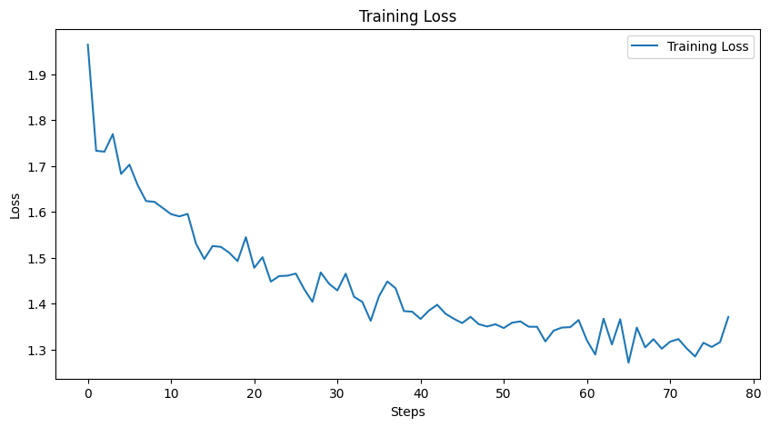

# **Efficient Instruction Fine-Tuning of LLMs with LoRA** 🚀

This repository provides a comprehensive, hands-on guide to instruction fine-tuning a Large Language Model (LLM) using a parameter-efficient technique called **Low-Rank Adaptation (LoRA)**. We transform the general-purpose `facebook/opt-350m` model into a specialized instruction-following agent capable of generating precise and relevant code and text based on user prompts.

This project demonstrates the entire workflow from data preparation and base model evaluation to efficient fine-tuning and comparative analysis, using the powerful Hugging Face ecosystem (`transformers`, `peft`, and `trl`).

---

## 🎯 Key Concepts & Techniques Covered

-   **Instruction Fine-Tuning:** Training a pre-trained LLM to better understand and follow human commands or instructions.
-   **Parameter-Efficient Fine-Tuning (PEFT):** Methods to adapt LLMs to new tasks without retraining all of the model's parameters, saving significant computational resources.
-   **Low-Rank Adaptation (LoRA):** A specific PEFT technique that injects small, trainable rank-decomposition matrices into the model's layers.
-   **Prompt Engineering & Templating:** Structuring the input data in a consistent format (`### Instruction: ...`) that the model can easily learn from.
-   **Hugging Face Ecosystem:** Leveraging `transformers` for models, `peft` for LoRA implementation, and `trl` for its specialized `SFTTrainer` (Supervised Fine-Tuning Trainer).
-   **Comparative Performance Analysis:** A clear demonstration of the model's capabilities **before** and **after** fine-tuning to showcase the effectiveness of the process.

---

##  Project Workflow

The project is detailed in the `LoRA_Finetuning_Walkthrough.ipynb` notebook and follows these key steps:

### 1. Setup & Data Preparation

-   **Dependencies:** Installation of all necessary libraries including `torch`, `transformers`, `datasets`, `peft`, and `trl`.
-   **Dataset:** The `CodeAlpaca-20k` dataset is loaded. It contains a rich set of instructions, optional inputs, and high-quality outputs, primarily focused on code generation.
-   **Data Splitting:** The dataset is split into an 80% training set and a 20% testing set.
-   **Prompt Formatting:** A custom function `format_prompt` is used to structure each data point into a consistent instruction template. This is crucial for the model to learn the pattern of instruction-following.

    ```python
    # Example of a formatted prompt without context/input
    template_without_input = (
        "Below is an instruction that describes a task. "
        "Write a response that appropriately completes the request.\n\n"
        "### Instruction:\n{instruction}\n\n### Response:\n"
    )

    # Example of a formatted prompt with context/input
    template_with_input = (
        "Below is an instruction that describes a task, paired with an input that provides further context. "
        "Write a response that appropriately completes the request.\n\n"
        "### Instruction:\n{instruction}\n\n### Input:\n{input}\n\n### Response:\n"
    )
    ```

### 2. Base Model Evaluation (Before Tuning)

Before any fine-tuning, we evaluate the performance of the base `facebook/opt-350m` model. This step establishes a baseline and highlights the model's initial inability to follow instructions correctly.

> **Observation:** The base model often fails to follow the instructions, repeats itself, or generates irrelevant text.

### 3. LoRA Configuration & Fine-Tuning

This is the core of the project. We use PEFT to efficiently fine-tune the model.

-   **LoRA Configuration:** We define a `LoraConfig` that specifies which layers of the model to adapt (e.g., `q_proj`, `v_proj`), the rank (`r`) of the decomposition matrices, and other hyperparameters.
-   **Model Wrapping:** The base model is wrapped with `get_peft_model` to prepare it for LoRA training.
-   **Supervised Fine-Tuning:** The `SFTTrainer` from the `trl` library is used to perform the training. This trainer is optimized for instruction-tuning tasks. The `DataCollatorForCompletionOnlyLM` ensures that the model only computes loss on the `### Response:` part of the prompt, making training more effective.

### 4. Results & Analysis

The effectiveness of instruction fine-tuning is demonstrated through a clear "before and after" comparison and analysis of the training process.

#### Training Loss

The training loss steadily decreases over the training steps, indicating that the model is successfully learning to follow the instruction format and produce the desired outputs.



#### Before vs. After Fine-Tuning

The qualitative results show a dramatic improvement in the model's ability to generate accurate and relevant responses.

| | Before Fine-Tuning (Base Model) | After Fine-Tuning (LoRA) |
| :---------------- | :----------------------------------------------------------------------------------------------------------------------------------- | :---------------------------------------------------------------------------------------------------------------------------------------------------- |
| **Instruction** | `Create a javascript class that takes in two arguments and prints them out when called.` | `Create a javascript class that takes in two arguments and prints them out when called.` |
| **Model Output** | `Once you have a response, write it down. Write it down. Write it down... ### Instructions: Add a JavaScript object to the end of the class.` | `class PrintNumber{ constructor(num1, num2){ this.num1 = num1; this.num2 = num2; } printNumber(){ console.log(\`${this.num1}, ${this.num2}\`); } }` |
| **Assessment** | ❌ **Failure:** The model misunderstands the task, generating repetitive and irrelevant text instead of code. | ✅ **Success:** The model correctly generates the requested JavaScript class, perfectly following the instruction. |

---

## 📂 Repository Structure
```
llm-instruction-tuning-lora
├── LoRA_Finetuning_Walkthrough.ipynb   # Main Jupyter Notebook with the full workflow.
├── config.py                       # Configuration for LoRA and SFTTrainer.
├── utils.py                        # Helper functions for formatting prompts and evaluation.
├── train_loss.png                   # Plot of the training loss curve.
├── instruction-tuning-log-history-lora.json # Training logs.
├── *.pkl                            # Saved model outputs for analysis.
└── README.md                       # You are here!
```

---

## 🛠️ How to Run

1.  **Clone the repository:**
    ```bash
    git clone https://github.com/nabeelshan78/llm-instruction-tuning-lora.git
    cd llm-instruction-tuning-lora
    ```

2.  **Launch Jupyter Lab:**
    ```bash
    jupyter lab
    ```

4.  **Run the Notebook:**
    Open `LoRA_Finetuning_Walkthrough` and execute the cells sequentially.

---

## Technologies Used


---
